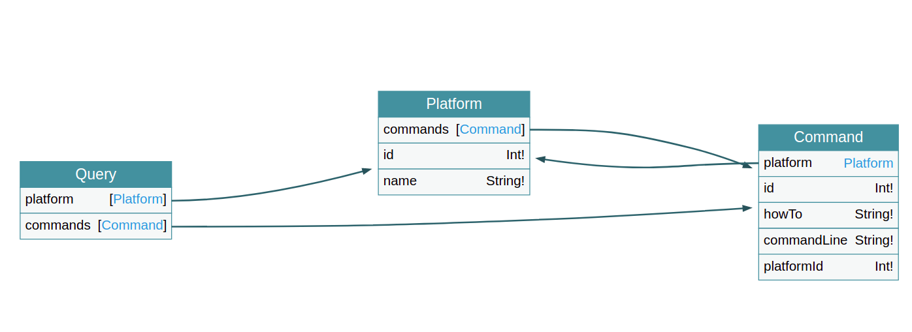

# Platform_Commands
Project uses .Net Core and GraphQL to generate commands based on available platforms.

## Getting Started

These instructions will get you a copy of the project up and running on your local machine for development. 

### Prerequisites
What things you need to install the software and how to install them?  
- [.Net Core](https://docs.microsoft.com/de-de/dotnet/core/install/linux-ubuntu)  
- [GraphQL](https://graphql.org/)
- [mySQL Server]()
- [Docker](https://www.docker.com/)

### Installing  
- Clone the project from github 
```sh
$ git clone git@github.com:manhton1992/Platform_Commands.git
```
- Go the the folder
```sh
cd CommanderGQL
```
- Install all dependencies
```sh
$ docker-compose up
To install local mysql server
$ dotnet build
To build project
$ dotnet run
To run project

### Project enpoints

GraphQL enpoint
$ http://localhost:5000/graphql/

GraphQL ralation
$ http://localhost:5000/ui/voyager




